# <center>**Conociendo Anaconda**


<center></center> 

<div style="text-align: right"> Por: _Diamanda Tapia_  </div>

   ### Anaconda es el ecosistema de ciencia de datos mas popular en el mundo, innovando en el desarrollo en proyectos de codigo abierto que son el fundamento de la ciencia moderna.

----------------------------------------------------------------------------------------------------------------------


## <center>***Guía de Instalación***</center> 

* _Búsqueda de software_
* Selección de software
* Ejecución de instalador
* Proceso de instalación
* Abrir navegador
* Seleccionar programa de interés

## 1. Búsqueda de software
### <center> Ingresar desde tu navegador a la pagina oficial _https://www.continuum.io/downloads_


   <td>   </td>
   


<Al ingresar a la pagina seleccionar la version de interes apara su ordenador>

## 2. Selección de software

 ####  Al ingresar a la página seleccionar su versión de interés de acuerdo a las características del ordenador 

####  Se recomienda la instalación de la versión más reciente debido a características mejoradas

   <td>  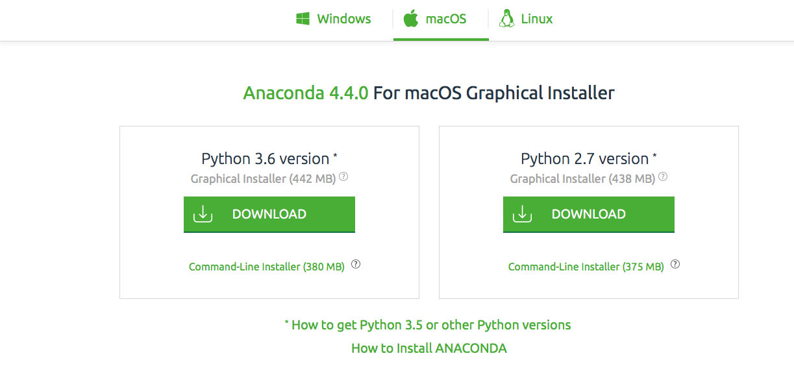 </td>
   <td>  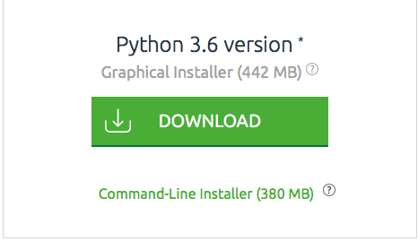 </td>


## 3. Ejecución de instalador

##### Mostrará una serie de pasos para su posterior instalación

<center> <center>

##  4.Proceso de instalación

|                                                                                                                    |   
|-------------------------------------------|------------------------------------------------------------------------|
| | 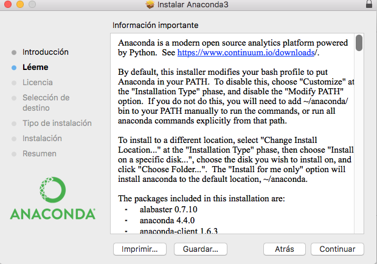| 
|
|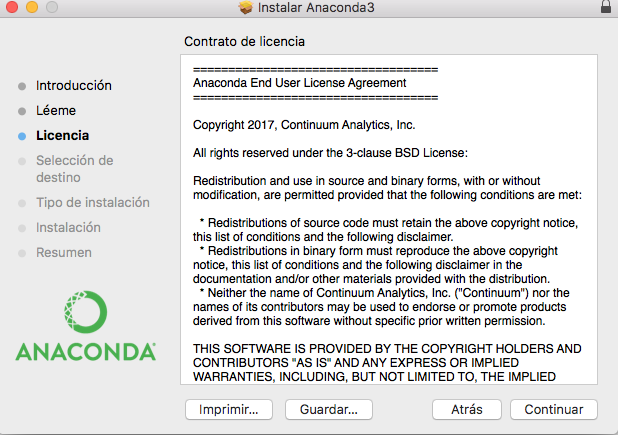|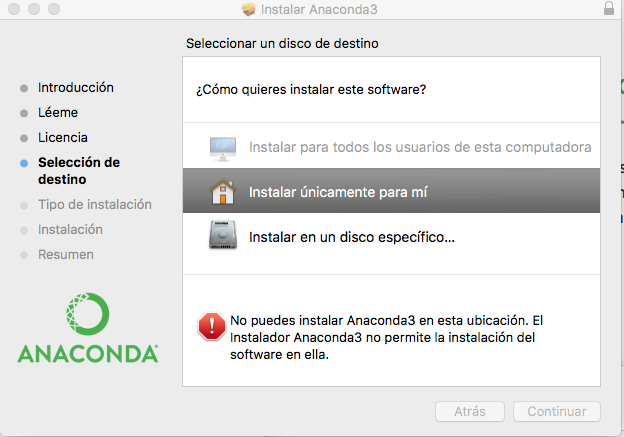
|
|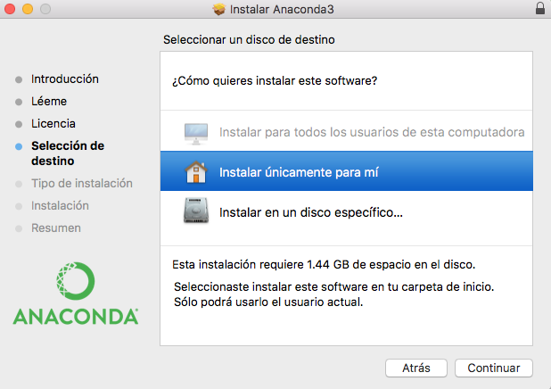|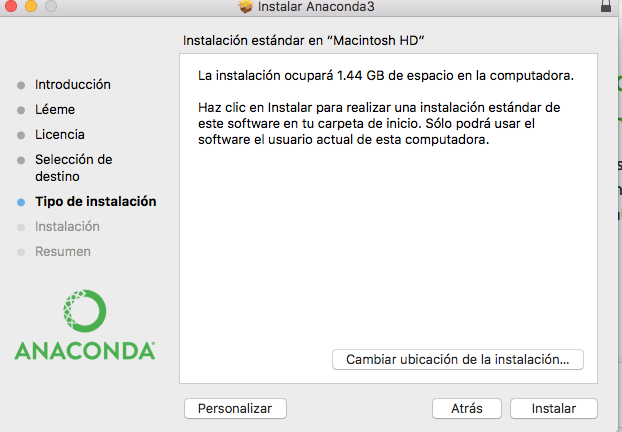
|
|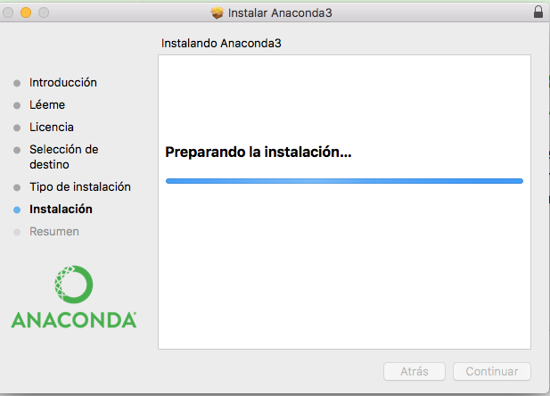|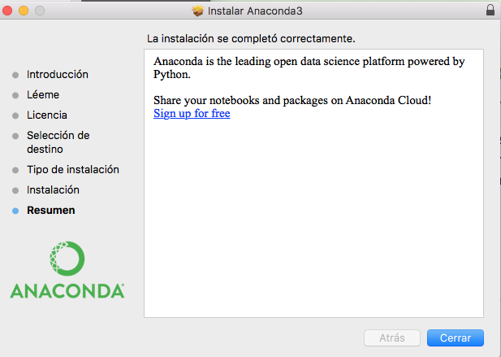


	
	


## 5. Abrir navegador

#### Cerrar ventana de culminación de instalación
  

  <td>  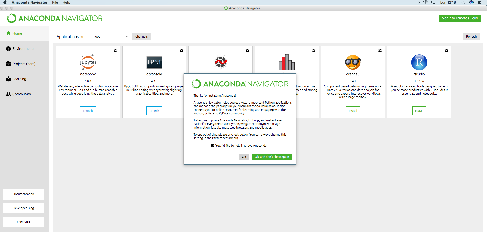 </td>
   <td>  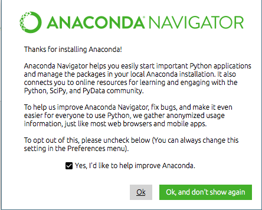 </td>

## 6. Seleccionar programa de interés

### _Ejemplo_

<center> <center>

# ¡Listo para navegar !


```python

```
