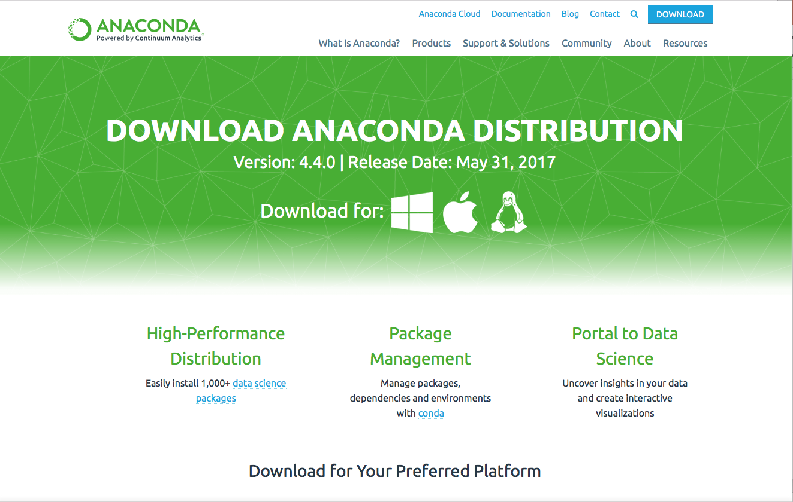
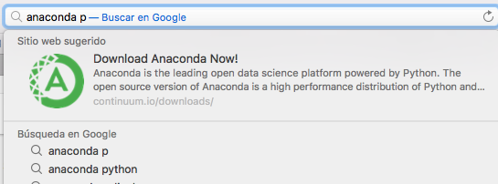

# 
**Conociendo Anaconda**

 

 Por: _Diamanda Tapia_  

   ### Anaconda es el ecosistema de ciencia de datos mas popular en el mundo, innovando en el desarrollo en proyectos de codigo abierto que son el fundamento de la ciencia moderna.

----------------------------------------------------------------------------------------------------------------------

## 
***Guía de Instalación***
 

* _Búsqueda de software_
* Selección de software
* Ejecución de instalador
* Proceso de instalación
* Abrir navegador
* Seleccionar programa de interés

## 1. Búsqueda de software
### 
 Ingresar desde tu navegador a la pagina oficial _https://www.continuum.io/downloads_

   <td>   </td>
   <td>   </td>

<Al ingresar a la pagina seleccionar la version de interes apara su ordenador>
